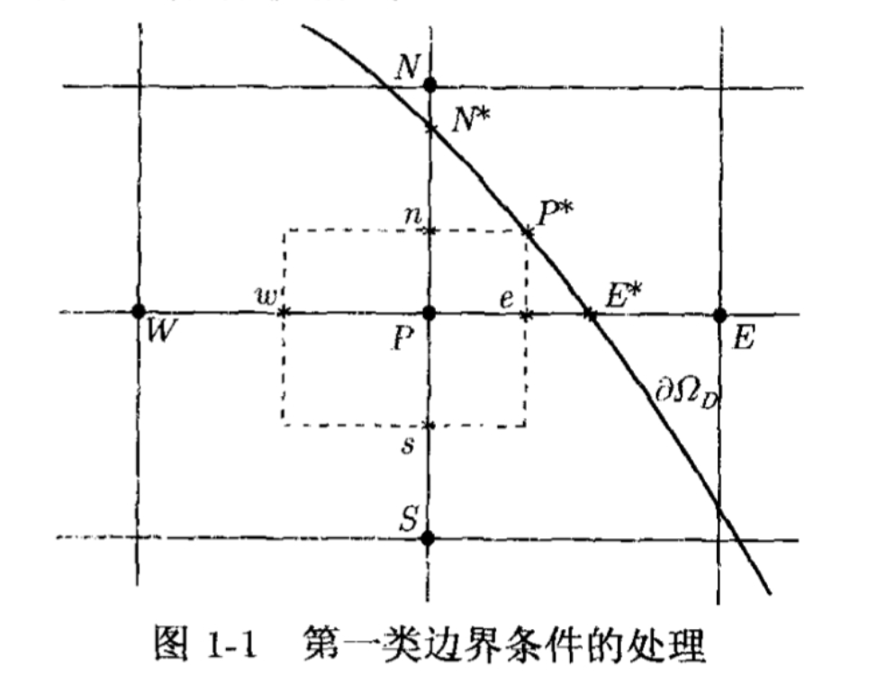

# 习题 1

!!! definition "网格、网格函数及其范数"
    设 $\Omega$ 是一个 $\mathbb{R}^n$ 中具有 Lipschitz 连续边界的有界开集，$\partial \Omega_D$ 对应 Dirichlet 边界。在 $\Omega$ 上定义网格，若最大步长 $h_{max}$ 与最小步长 $h_{min}$ 满足 $\frac{h_{max}}{h_{min}}\le C$，则称该网格为拟一致网格。特别的若网格为均匀网格，则称该网格为一致网格。

    定义多重指标集：

    $$
    J=\{j=(j_1,j_2,\cdots,j_n)| x=x_j = (j_1h_1, j_2h_2, \cdots, j_nh_n)\in \bar{\Omega}\},
    $$

    称之为 $\bar{\Omega}$ 上的网格节点指标集。网格函数 $U$ 定义为 $J$ 上的函数族 $\{U_j\}_{j\in J}$。令

    $$
    \omega_j=\{x\in \Omega| x=(x_1,x_2,\cdots,x_n), (j_k -\tfrac{1}{2})h_k < x_k < (j_k + \tfrac{1}{2})h_k, k=1,2,\cdots,n\},
    $$
    
    称之为网格节点 $j$ 的控制体，其测度记作 $V_j$。定义网格函数 $U$ 的 $L^p$ 范数($p\in [1,\infty)$) 为

    $$
    ||U||_{L^p} = \left(\sum_{j\in J} V_j |U_j|^p\right)^{1/p},
    $$

!!! problem "1."
    证明：对最大步长为 $h$ 的拟一致网格序列，定义的网格函数的 $L^p$ 范数($p\in [1,\infty)$) 满足 $||\cdot ||_{L^p} \sim h^{n/p}||\cdot ||_{l^p}$，即存在常数 $c,C$ 使得定义在该网格上的任意网格函数 $U$，都有
    
    $$ c h^{n/p} \left(\sum_{j\in J} |U_j|^p\right)^{1/p}\le \left(\sum_{j\in J} V_j|U_j|^p\right)^{1/p} \le C h^{n/p} \left(\sum_{j\in J} |U_j|^p\right)^{1/p}, $$

    其中 $V_j$ 是网格节点 $j$ 的控制体的测度

??? proof "解："
    由于网格为拟一致网格，存在常数 $C_1,C_2$ 使得对任意 $j\in J$，都有

    $$
    C_1 h^n \le V_j \le C_2 h^n.
    $$

    因此对任意网格函数 $U$，都有

    $$
    \sum_{j\in J} V_j |U_j|^p \le C_2 h^n \sum_{j\in J} |U_j|^p,
    $$

    以及

    $$
    \sum_{j\in J} V_j |U_j|^p \ge C_1 h^n \sum_{j\in J} |U_j|^p.
    $$

    取 $p$ 次方根即得所需不等式。

!!! problem "2."
    证明：对拟一致网格序列，定义的网格函数的 $L^p$ 范数诱导的相应矩阵范数满足 $||\cdot ||_{L^p} \sim ||\cdot ||_{l^p}$，即存在常数 $c,C$ (其中 $0 < c \leqslant C$)，使得对定义在该网格序列中任一网格函数空间上的线性变换 $A$，都有

    $$
    c||A||_{l^p} \leqslant ||A||_{L^p} \leqslant C||A||_{l^p},
    $$

    其中 $||A||_{l^p}$ 是由向量范数 $||\cdot ||_{l^p}$ 诱导的矩阵范数。

??? proof "解："
    由习题 1 可知，存在常数 $c_1,C_1$ 使得对定义在该网格上的任意网格函数 $U$，都有

    $$
    c_1 ||U||_{l^p} \leqslant ||U||_{L^p} \leqslant C_1 ||U||_{l^p}.
    $$

    因此对定义在该网格上的任意线性变换 $A$ 和任意非零网格函数 $U$，都有

    $$
    \frac{||AU||_{L^p}}{||U||_{L^p}} \leqslant \frac{C_1 ||AU||_{l^p}}{c_1 ||U||_{l^p}}.
    $$

    对上式左端取上确界，并对右端取下确界，即得

    $$
    ||A||_{L^p} \leqslant \frac{C_1}{c_1} ||A||_{l^p}.
    $$

    同理可得

    $$
    ||A||_{L^p} \geqslant \frac{c_1}{C_1} ||A||_{l^p}.
    $$

    综上所述，取 $c = \frac{c_1}{C_1}, C = \frac{C_1}{c_1}$ 即得所需不等式。

!!! definition "一些差分"
    考虑 $\Omega\subset \mathbb{R}^2$ 上的定常对流扩散方程

    $$
    -\nabla \cdot (a(x,y) \nabla u(x,y)) +\nabla \cdot (u(x,y)v(x,y)) = f(x,y), \quad \forall(x,y)\in \Omega,
    $$

    其中 $v(x,y)=(v^1,v^2)$。在步长为 $h_x=\Delta x, h_y=\Delta y$ 的网格上对二阶和一阶微商作以下替换：

    $$
    \begin{aligned}
    [(au_x)_x]_{i,j} &\approx \frac{1}{h_x} \left( a_{i+\frac{1}{2},j} \frac{U_{i+1,j}-U_{i,j}}{h_x} - a_{i-\frac{1}{2},j} \frac{U_{i,j}-U_{i-1,j}}{h_x} \right), \\
    [(au_y)_y]_{i,j} &\approx \frac{1}{h_y} \left( a_{i,j+\frac{1}{2}} \frac{U_{i,j+1}-U_{i,j}}{h_y} - a_{i,j-\frac{1}{2}} \frac{U_{i,j}-U_{i,j-1}}{h_y} \right), \\
    [2(uv^1)_x]_{i,j} &\approx \frac{1}{h_x} \left((uv^1)_{i+1,j}-(uv^1)_{i-1,j} \right),\\
    [2(uv^2)_y]_{i,j} &\approx \frac{1}{h_y} \left((uv^2)_{i,j+1}-(uv^2)_{i,j-1} \right).
    \end{aligned}
    $$

    就得到差分格式

    $$
    \begin{aligned}
        -&\frac{1}{h_x} \left( a_{i+\frac{1}{2},j} \frac{U_{i+1,j}-U_{i,j}}{h_x} - a_{i-\frac{1}{2},j} \frac{U_{i,j}-U_{i-1,j}}{h_x} \right) \\
        -&\frac{1}{h_y} \left( a_{i,j+\frac{1}{2}} \frac{U_{i,j+1}-U_{i,j}}{h_y} - a_{i,j-\frac{1}{2}} \frac{U_{i,j}-U_{i,j-1}}{h_y} \right) \\
        +&\frac{1}{h_x} \left((U_{i+1,j} v^1_{i+1,j} - U_{i-1,j} v^1_{i-1,j}) \right)+\frac{1}{h_y} \left((U_{i,j+1} v^2_{i,j+1} - U_{i,j-1} v^2_{i,j-1}) \right) = f_{i,j}.
    \end{aligned}
    $$

    再考虑积分形式：

    $$
    \int_{\partial \omega} a(x,y)\nabla u(x,y) \cdot \nu(x,y) ds-\int_{\partial \omega} u(x,y) v(x,y) \cdot \nu(x,y) ds + \int_{\omega} f(x,y) d\omega=0,
    $$

    其中 $\omega$ 是任意具有分片光滑边界的开子集，$\nu$ 是 $\partial \omega$ 上的外法向量。对 $(i,j)\in J_{\Omega}$ 取控制体

    $$
    \omega_{i,j} = \{(x,y)| (i-\tfrac{1}{2})h_x < x < (i+\tfrac{1}{2})h_x, (j-\tfrac{1}{2})h_y < y < (j+\tfrac{1}{2})h_y \},
    $$

    在 $\omega_{i,j}$ 及其四条直边上分别用中点数值积分公式，将各直边中点处未知函数的法向导数用最近两个相邻节点上的函数值的差商近似，并将未知函数在各直边中点处的函数值用相邻两个节点上的函数值的平均值近似，就得到守恒型差分格式

    $$
    \begin{aligned}
        -&\frac{1}{h_x} \left( a_{i+\frac{1}{2},j} \frac{U_{i+1,j}-U_{i,j}}{h_x} - a_{i-\frac{1}{2},j} \frac{U_{i,j}-U_{i-1,j}}{h_x} \right) \\
        -&\frac{1}{h_y} \left( a_{i,j+\frac{1}{2}} \frac{U_{i,j+1}-U_{i,j}}{h_y} - a_{i,j-\frac{1}{2}} \frac{U_{i,j}-U_{i,j-1}}{h_y} \right) \\
        +&\frac{1}{2h_x} \left( (U_{i+1,j} + U_{i,j}) v^1_{i+\frac{1}{2},j} - (U_{i,j} + U_{i-1,j}) v^1_{i-\frac{1}{2},j} \right) \\
        +&\frac{1}{2h_y} \left( (U_{i,j+1} + U_{i,j}) v^2_{i,j+\frac{1}{2}} - (U_{i,j} + U_{i,j-1}) v^2_{i,j-\frac{1}{2}} \right) = f_{i,j}.
    \end{aligned}
    $$
!!! problem "3."
    试分析上述两个差分格式的截断误差。

??? proof "解："
    设 $u(x,y)$ 在 $(x_i,y_j)$ 处具有充分的光滑性，对差分格式中的各项分别作 Taylor 展开。

    第一个差分格式中，扩展 $(au_x)_x$ 项：

    $$
    \begin{aligned}
    &-\frac{1}{h_x} \left( a_{i+\frac{1}{2},j} \frac{U_{i+1,j}-U_{i,j}}{h_x} - a_{i-\frac{1}{2},j} \frac{U_{i,j}-U_{i-1,j}}{h_x} \right) \\
    =& -(au_x)_x|_{(x_i,y_j)} - \frac{h_x^2}{12} \left( a u_{xxxx} + 2 a_x u_{xxx} + a_{xx} u_{xx} \right)|_{(x_i,y_j)} + O(h_x^4).
    \end{aligned}
    $$

    同理可得 $(au_y)_y$ 项的展开式：

    $$
    \begin{aligned}
    &-\frac{1}{h_y} \left( a_{i,j+\frac{1}{2}} \frac{U_{i,j+1}-U_{i,j}}{h_y} - a_{i,j-\frac{1}{2}} \frac{U_{i,j}-U_{i,j-1}}{h_y} \right) \\
    =& -(au_y)_y|_{(x_i,y_j)} - \frac{h_y^2}{12} \left( a u_{yyyy} + 2 a_y u_{yyy} + a_{yy} u_{yy} \right)|_{(x_i,y_j)} + O(h_y^4).
    \end{aligned}
    $$

    对对流项作 Taylor 展开：

    $$
    \begin{aligned}
    &\frac{1}{h_x} \left((U_{i+1,j} v^1_{i+1,j} - U_{i-1,j} v^1_{i-1,j}) \right) \\
    =& (uv^1)_x|_{(x_i,y_j)} + \frac{h_x^2}{6} (uv^1)_{xxx}|_{(x_i,y_j)} + O(h_x^4),
    \end{aligned}
    $$

    以及
    $$
    \begin{aligned}
    &\frac{1}{h_y} \left((U_{i,j+1} v^2_{i,j+1} - U_{i,j-1} v^2_{i,j-1}) \right) \\
    =& (uv^2)_y|_{(x_i,y_j)} + \frac{h_y^2}{6} (uv^2)_{yyy}|_{(x_i,y_j)} + O(h_y^4).
    \end{aligned}
    $$

    综上所述，第一个差分格式的截断误差为

    $$
    \begin{aligned}
        \tau_{i,j}= & -\frac{h_x^2}{12} \left( a u_{xxxx} + 2 a_x u_{xxx} + a_{xx} u_{xx} \right)|_{(x_i,y_j)} - \frac{h_y^2}{12} \left( a u_{yyyy} + 2 a_y u_{yyy} + a_{yy} u_{yy} \right)|_{(x_i,y_j)} \\
        & + \frac{h_x^2}{6} (uv^1)_{xxx}|_{(x_i,y_j)} + \frac{h_y^2}{6} (uv^2)_{yyy}|_{(x_i,y_j)} + O(h_x^4 + h_y^4) = O(h_x^2 + h_y^2).
    \end{aligned}
    $$

    对第二个差分格式，类似地可得其截断误差为

    $$
    \begin{aligned}
    \tau_{i,j} = & -\frac{h_x^2}{12} \left( a u_{xxxx} + 2 a_x u_{xxx} + a_{xx} u_{xx} \right)|_{(x_i,y_j)} - \frac{h_y^2}{12} \left( a u_{yyyy} + 2 a_y u_{yyy} + a_{yy} u_{yy} \right)|_{(x_i,y_j)} \\
    & + \frac{h_x^2}{8} (uv^1)_{xxx}|_{(x_i,y_j)} + \frac{h_y^2}{8} (uv^2)_{yyy}|_{(x_i,y_j)} + O(h_x^4 + h_y^4) = O(h_x^2 + h_y^2).
    \end{aligned}
    $$

!!! problem "4."
    如图 1-1 所示，设 $U$ 在线段 $\overline{SN}$ 上为 $y$ 的二次多项式，试推导利用 $U_S, U_P$ 和 $U_{N^*}$ 表出 $U_N$ 的外推公式，并推导出利用 $U_W, U_P$ 和 $U_{E^*}$ 表出 $U_E$ 的外推公式。

??? proof "解："
    设 $U$ 在线段 $\overline{SN}$ 上为 $y$ 的二次多项式，则有

    $$
    U(y) = a y^2 + b y + c.
    $$

    由 $U_S = U(y_j - h), U_P = U(y_j), U_{N^*} = U(y_j + h)$ 可得

    $$
    \begin{aligned}
    U_S &= a (y_j - h)^2 + b (y_j - h) + c, \\
    U_P &= a y_j^2 + b y_j + c, \\
    U_{N^*} &= a (y_j + h)^2 + b (y_j + h) + c.
    \end{aligned}
    $$

    解出 $a,b,c$ 并代入 $U_N = U(y_j + 2h)$，即可得到

    $$
    U_N = -U_S + 4 U_P - 2 U_{N^*}.
    $$

    同理可得

    $$
    U_E = -U_W + 4 U_P - 2 U_{E^*}.
    $$

!!! problem "5."
    如图 1-1 所示，利用函数 $u$ 在点 $P$ 的 Taylor 展开式分别将其在点 $W, E^*, S, N^*$ 的函数值近似表出，再由这四个方程解出 $u_x, u_y, u_{xx}, u_{yy}$ 在点 $P$ 的近似值，即我们将它们由 $u$ 在点 $W, E^*, S, N^*$ 的函数值近似表出。由此导出微分方程 $-\Delta u + c u_x + d u_y = f$ 在点 $P$ 的差分格式及其截断误差。

??? proof "解："
    设点 $P$ 的坐标为 $(x_j,y_j)$，则点 $W, E^*, S, N^*$ 的坐标分别为 $(x_j - h, y_j), (x_j + 2h, y_j), (x_j, y_j - h), (x_j, y_j + 2h)$。由 Taylor 展开式可得

    $$
    \begin{aligned}
    u_W &= u_P - h u_x|_P + \frac{h^2}{2} u_{xx}|_P - \frac{h^3}{6} u_{xxx}|_P + O(h^4), \\
    u_{E^*} &= u_P + 2h u_x|_P + 2h^2 u_{xx}|_P + \frac{4h^3}{3} u_{xxx}|_P + O(h^4), \\
    u_S &= u_P - h u_y|_P + \frac{h^2}{2} u_{yy}|_P - \frac{h^3}{6} u_{yyy}|_P + O(h^4), \\
    u_{N^*} &= u_P + 2h u_y|_P + 2h^2 u_{yy}|_P + \frac{4h^3}{3} u_{yyy}|_P + O(h^4).
    \end{aligned}
    $$

    由上式解出 $u_x, u_y, u_{xx}, u_{yy}$ 在点 $P$ 的近似值为

    $$
    \begin{aligned}
    u_x|_P &\approx \frac{-u_W + 4 u_P - 2 u_{E^*}}{3h}, \\
    u_y|_P &\approx \frac{-u_S + 4 u_P - 2 u_{N^*}}{3h}, \\
    u_{xx}|_P &\approx \frac{u_W - 5 u_P + 4 u_{E^*}}{3h^2}, \\
    u_{yy}|_P &\approx \frac{u_S - 5 u_P + 4 u_{N^*}}{3h^2}.
    \end{aligned}
    $$

    将上述近似值代入微分方程 $-\Delta u + c u_x + d u_y = f$，即可得到差分格式

    $$
    \begin{aligned}
    & -\left( \frac{u_W - 5 u_P + 4 u_{E^*}}{3h^2} + \frac{u_S - 5 u_P + 4 u_{N^*}}{3h^2} \right) \\
    & + c \left( \frac{-u_W + 4 u_P - 2 u_{E^*}}{3h} \right) + d \left( \frac{-u_S + 4 u_P - 2 u_{N^*}}{3h} \right) = f_P.
    \end{aligned}
    $$

    通过对各项作 Taylor 展开，可得该差分格式的截断误差为 $O(h^2)$。

!!! problem "9."
    证明推论 1.2：设线性差分算子 $L_h$ 满足：

    * (1) $J_D\neq \emptyset$，且 $J=J_{\Omega} \cup J_D$ 关于算子 $L_h$ 是 $J_D$ 连通的；
    * (2) 对任意的 $j\in J_\Omega$，都有 $c_j>0$ 和 $c_{ij}>0(\forall i\in D_{L_h}(j))$，且 $c_j\ge \sum_{i\in D_{L_h}(j)} c_{ij}$。

    则差分方程 $-L_hU_j=f_j,U_j=g_j$ 的解满足：
    
    * 若 $f_j\ge 0(\forall j\in J_{\Omega})$，且 $g_j\ge 0(\forall j\in J_D)$，则 $U_j \ge 0 (\forall j\in J)$。
    * 若 $f_j\le 0(\forall j\in J_{\Omega})$，且 $g_j\le 0(\forall j\in J_D)$，则 $U_j \le 0 (\forall j\in J)$。

??? proof "解："

    用反证法证明。假设存在 $j_0\in J$ 使得 $U_{j_0}<0$。由于 $g_j\ge 0(\forall j\in J_D)$，故 $j_0\in J_{\Omega}$。令 $j^*$ 是使得 $U_{j^*}=\min_{j\in J} U_j<0$ 的点，则 $j^*\in J_{\Omega}$。在点 $j^*$ 处，对差分方程有

    $$c_{j^*} U_{j^*} - \sum_{i\in D_{L_h}(j^*)} c_{ij^*} U_i = f_{j^*}.$$

    由于 $U_{j^*}$ 是最小值，故 $U_i\ge U_{j^*}$（$\forall i\in D_{L_h}(j^*)$）。

    因此

    $$c_{j^*} U_{j^*} - \sum_{i\in D_{L_h}(j^*)} c_{ij^*} U_i \le c_{j^*} U_{j^*} - \sum_{i\in D_{L_h}(j^*)} c_{ij^*} U_{j^*} = \left(c_{j^*} - \sum_{i\in D_{L_h}(j^*)} c_{ij^*}\right) U_{j^*} \le 0.$$

    但 $f_{j^*}\ge 0$，故矛盾。

    第二个结论类似可证。

!!! problem "10."
    设线性差分算子 $L_h$ 满足定理 1.2 的条件 (1) 和 (2)，又设两个网格函数 $U, V$ 满足

    $$|L_h U_j| \geqslant L_h V_j \ (\forall j \in J_{\Omega}) \quad \text{和} \quad |U_j| \leqslant V_j \ (\forall j \in J_D).$$

    证明：$|U_j| \leqslant V_j, \forall j \in J$。

??? proof "证明："
    构造两个辅助网格函数 $\Phi_j = V_j - U_j$ 和 $\Psi_j = V_j + U_j$。

    首先考察边界条件。对于 $j \in J_D$，由已知条件 $|U_j| \leqslant V_j$ 可知 $-V_j \leqslant U_j \leqslant V_j$，从而有 $\Phi_j \ge 0$ 且 $\Psi_j \ge 0$。

    接下来考察内部节点 $j \in J_{\Omega}$。利用算子 $L_h$ 的线性性质，我们有：

    $$L_h \Phi_j = L_h V_j - L_h U_j, \quad L_h \Psi_j = L_h V_j + L_h U_j.$$

    根据题目意图及比较定理的标准形式，可得：

    $$L_h V_j \geqslant L_h U_j \implies L_h \Phi_j \geqslant 0,$$

    $$L_h V_j \geqslant -L_h U_j \implies L_h \Psi_j \geqslant 0.$$

    根据 Problem 9 中推论 1.2 的结论，对于满足上述条件的线性差分算子，我们可以得出：

    $$\Phi_j \ge 0 \quad \text{和} \quad \Psi_j \ge 0, \quad \forall j \in J.$$

    这意味着 $V_j - U_j \ge 0$ 且 $V_j + U_j \ge 0$，即 $-V_j \leqslant U_j \leqslant V_j$。

    综上所述，我们证得 $|U_j| \leqslant V_j, \forall j \in J$。"

!!! problem "11."
    利用式 $L_h(U_h-u-h^2\psi)_j=L_h(e_h-h^2\psi)_j=O(h^4)$ 和比较定理证明差分逼近解误差的渐近展开式

    $$
    U_j=u_j+h^2\psi_j+O(h^4),\forall j\in J_h,
    $$

    其中 $\psi$ 为齐次 Dirichlet 边值问题的解。

??? proof "证明："
    令余项网格函数为 $r_j = U_j - (u_j + h^2\psi_j)$。为了证明题目中的渐近展开式，只需证明 $|r_j| = O(h^4)$。首先考察内部节点 $j \in J_{\Omega}$，根据题目给出的截断误差条件 $L_h(U_h-u-h^2\psi)_j = O(h^4)$，可知存在常数 $C_1 > 0$ 使得 $|L_h r_j| \leqslant C_1 h^4$ 成立。其次考察边界节点 $j \in J_D$，由于 $U_j$ 满足 Dirichlet 边界条件即 $U_j=u_j$，且已知 $\psi$ 为齐次边值问题的解即 $\psi_j=0$，因此在边界上 $r_j = U_j - u_j - h^2\psi_j = 0$。

    接下来构造优函数以应用比较定理。设 $W_j$ 为方程 $L_h W_j = 1$ ($j \in J_{\Omega}$) 且边界非负的有界解，定义比较函数 $V_j = C_1 h^4 W_j$。利用算子 $L_h$ 的线性性质，我们有 $L_h V_j = C_1 h^4$，从而满足 $L_h V_j \geqslant |L_h r_j|$。同时在边界上显然有 $V_j \ge 0 = |r_j|$。

    根据 Problem 10 证明的比较定理，我们可以得出 $|r_j| \leqslant V_j = C_1 h^4 W_j$。由于 $W_j$ 是与步长 $h$ 无关的有界量，这就证明了 $r_j = O(h^4)$，即 $U_j = u_j + h^2\psi_j + O(h^4)$ 成立。"

!!! problem "12."
    证明：当微分方程差分格式的解 $U_h$ 的误差主项为 $O(h^2)$ 时，有

    $$U_{h/2,j} - u_j = \frac{1}{3} \left(U_{h,j} - U_{h/2,j}\right) + o(h^2), \quad \forall j \in J_h.$$

??? proof "证明："
    由 Problem 11 可知，差分逼近解的误差渐近展开式为 $U_j = u_j + h^2 \psi_j + O(h^4)$。因此，对于步长为 $h/2$ 的解 $U_{h/2,j}$，有

    $$U_{h/2,j} = u_j + \left(\frac{h}{2}\right)^2 \psi_j + O\left(\left(\frac{h}{2}\right)^4\right) = u_j + \frac{h^2}{4} \psi_j + O(h^4).$$

    代入 $U_{h,j} = u_j + h^2 \psi_j + O(h^4)$，我们得到

    $$U_{h/2,j} - u_j = \left(u_j + \frac{h^2}{4} \psi_j + O(h^4)\right) - u_j = \frac{h^2}{4} \psi_j + O(h^4).$$

    同时，对于 $U_{h,j} - U_{h/2,j}$，有

    $$U_{h,j} - U_{h/2,j} = \left(u_j + h^2 \psi_j + O(h^4)\right) - \left(u_j + \frac{h^2}{4} \psi_j + O(h^4)\right) = \frac{3h^2}{4} \psi_j + O(h^4).$$

    因此，我们有

    $$U_{h/2,j} - u_j = \frac{1}{3} \left(U_{h,j} - U_{h/2,j}\right) + O(h^4)= \frac{1}{3} \left(U_{h,j} - U_{h/2,j}\right) + o(h^2).$$

!!! problem "13."
    设微分方程差分格式的解 $U_h$ 的误差主项为 $O(h^2)$，且误差余项为 $O(h^4)$，试利用 $U_h, U_{h/2}, U_{h/4}$ 估算出由式
    
    $$ U_{h,j}^1=\frac{4}{3} U_{h/2,j} - \frac{1}{3} U_{h,j} =u_j+O(h^4),\forall j\in J_h$$
    
    给出的 $U_h^1$ 的误差主项。当数值结果满足什么条件时，可以认为由
    
    $$ U_{h,j}-u_j=\frac{4}{3}(U_{h,j}-U_{h/2,j})+O(h^4),\forall j\in J_h $$
    
    得到的误差主项给出的误差估计是可靠的？

??? proof "解："
    
    设差分格式解 $U_h$ 的误差展开式为：

    $$
    U_h = u + C_2 h^2 + C_4 h^4 + O(h^6)
    $$

    其中 $u$ 是精确解，$C_2, C_4$ 是与 $h$ 无关的系数。将误差展开式代入：

    $$
    \begin{aligned}
    U_h^1 &= \frac{4}{3} \left( u + C_2 \left(\frac{h}{2}\right)^2 + C_4 \left(\frac{h}{2}\right)^4 \right) - \frac{1}{3} \left( u + C_2 h^2 + C_4 h^4 \right) \\
    &= \frac{4}{3} \left( u + \frac{1}{4}C_2 h^2 + \frac{1}{16}C_4 h^4 \right) - \frac{1}{3} u - \frac{1}{3} C_2 h^2 - \frac{1}{3} C_4 h^4 \\
    &= u - \frac{1}{4} C_4 h^4 + O(h^6)
    \end{aligned}
    $$

    由此可见，$U_h^1$ 的误差主项为 $-\frac{1}{4} C_4 h^4$。

    利用更细网格 $U_{h/2}$ 和 $U_{h/4}$ 构造 $U_{h/2}^1$：

    $$
    U_{h/2}^1 = \frac{4}{3} U_{h/4} - \frac{1}{3} U_{h/2}= u - \frac{1}{64} C_4 h^4 + \dots
    $$

    $$
    \begin{aligned}
    U_h^1 - U_{h/2}^1 &\approx  -\frac{15}{64} C_4 h^4
    \end{aligned}
    $$

    $$
    E(U_h^1) \approx -\frac{1}{4} C_4 h^4 \approx \frac{16}{15} (U_h^1 - U_{h/2}^1)=\frac{16}{45} \left( 5 U_{h/2} - U_h - 4 U_{h/4} \right)
    $$

!!! problem "14."
    试用直接法分析区域 $(0,1) \times (0,1)$ 上步长为 $h$ 的均匀网格上 Poisson 方程第一边值问题五点差分格式在 $\mathbb{L}^\infty$ 和 $\mathbb{L}^2$ 范数意义下的稳定性。
